# FastAPI Microservices

Этот репозиторий содержит два микросервиса на FastAPI с использованием SQLite:

1. **TODO Service** – управление списком задач (CRUD)
2. **Short URL Service** – генерация и управление короткими ссылками

---

## Технологический стек

- Python 3.11
- FastAPI — веб-фреймворк для создания API
- Uvicorn — ASGI-сервер
- SQLite — легковестная база данных
- Pydantic — схемы и валидация
- Docker — контейнеризация
- Swagger — тестирование API

---

## Диаграмма

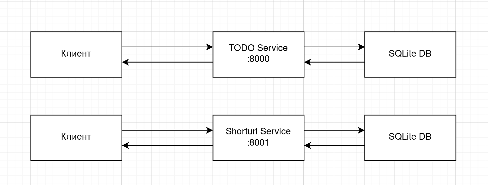

---

## Структура проекта

```
.
├── todo/
│   ├── app/
│   │   ├── main.py
│   │   ├── database.py
│   │   └── schemas.py
│   ├── Dockerfile
│   └── requirements.txt
├── shorturl/
│   ├── app/
│   │   ├── main.py
│   │   ├── database.py
│   │   └── schemas.py
│   ├── Dockerfile
│   └── requirements.txt
└── README.md
```

---

## Установка и запуск

### Через Docker

1. Постройте образ:

```bash
docker build -t todo ./todo
docker build -t shorturl ./shorturl
```

2. Запустите контейнер с volume для данных:

```bash
docker run -d -p 8000:80 -v todo_data:/app/data todo_service
docker run -d -p 8001:80 -v shorturl_data:/app/data shorturl_service
```

- TODO сервис → `http://localhost:8000`
- Short URL сервис → `http://localhost:8001`

---

## Документация

- TODO сервис → `http://localhost:8000/docs`
- Short URL сервис → `http://localhost:8001/docs`

---

## TODO Service

### Методы API

| Метод | URL | Описание |
|-------|-----|----------|
| `POST` | `/items` | Создать задачу |
| `GET` | `/items` | Получить все задачи |
| `GET` | `/items/{item_id}` | Получить задачу по ID |
| `GET` | `/items/status?completed=true` | Фильтрация по статусу |
| `PUT` | `/items/{item_id}` | Обновить задачу |
| `DELETE` | `/items/{item_id}` | Удалить задачу |
| `GET` | `/items/search?q=<text>` | Поиск по заголовку и описанию |
| `GET` | `/items/stats` | Статистика задач (total, completed, pending) |

---

### Демонстрация работы

1. Создание записи
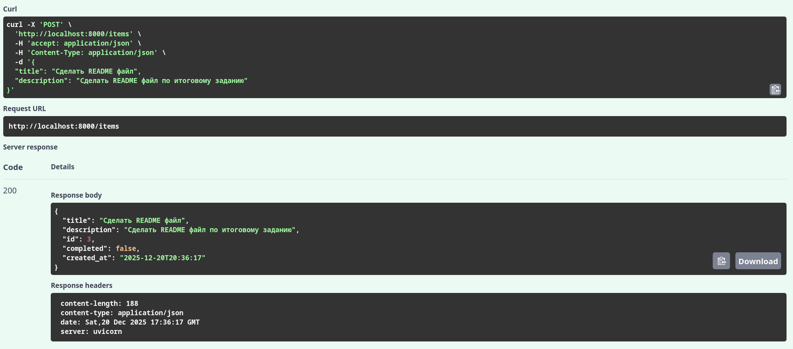

2. Получение всех записей
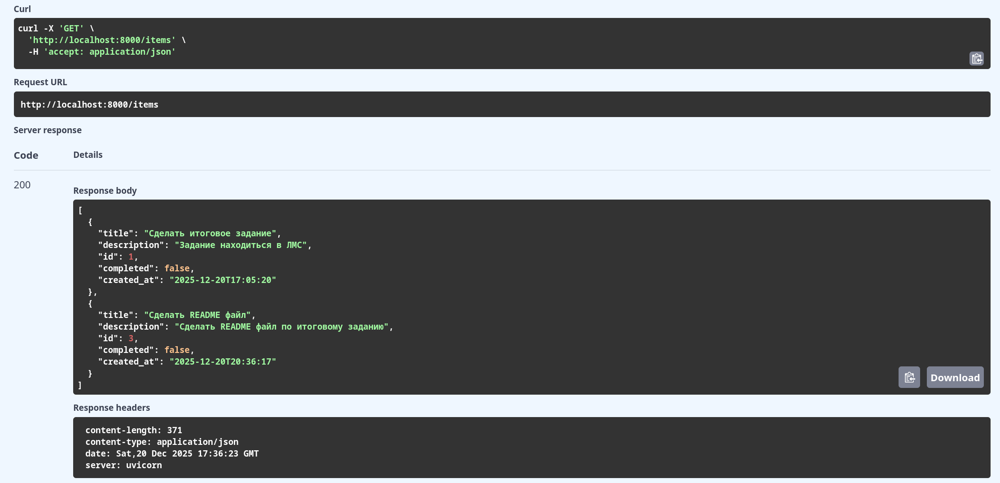

3. Поиск записи по названию
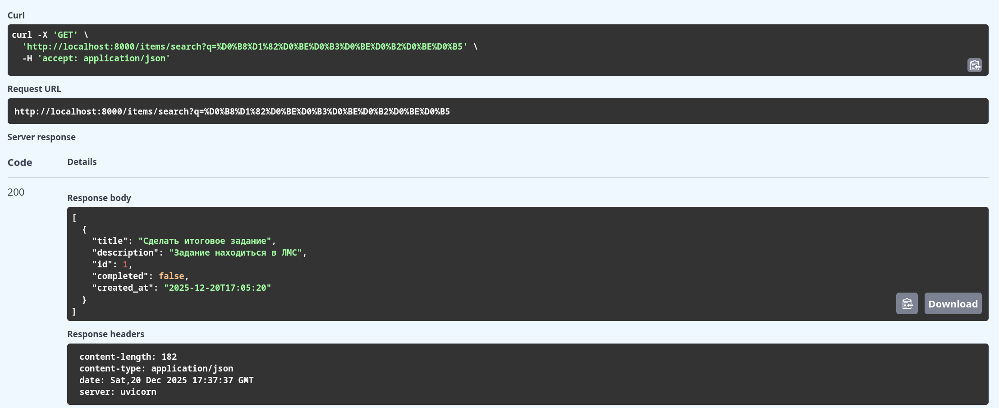

4. Поиск по полю completed
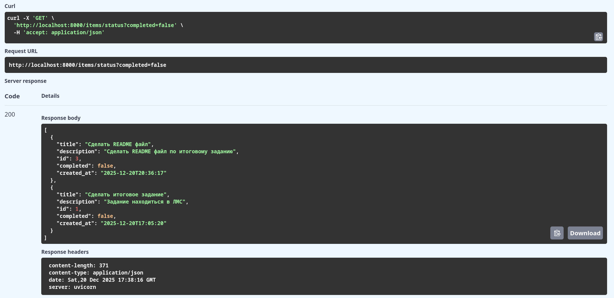

5. Получение записи по id
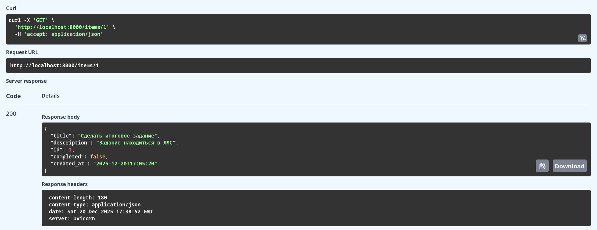

6. Удаления записи по id
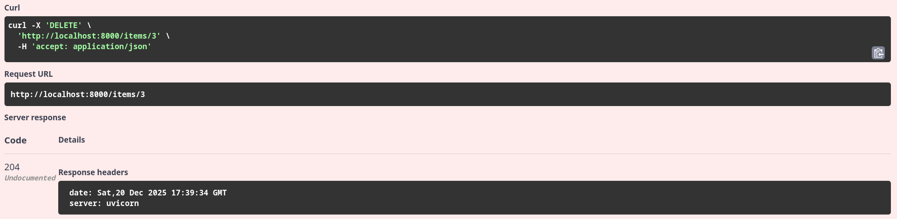

7. Обновления записи по id
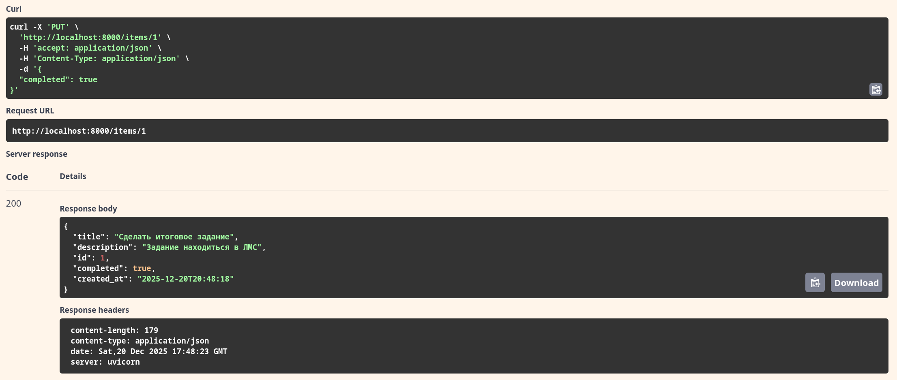

---

## Short URL Service

### Методы API

| Метод | URL | Описание |
|-------|-----|----------|
| `POST` | `/shorten` | Создать короткую ссылку |
| `GET` | `/{short_id}` | Перейти по короткой ссылке (редирект) |
| `GET` | `/stats/{short_id}` | Получить статистику ссылки |
| `PUT` | `/urls/{short_id}` | Обновить полную ссылку |
| `GET` | `/urls/popular` | Получить самые популярные ссылки |

---

### Демонстрация работы

1. Создания короткой ссылки
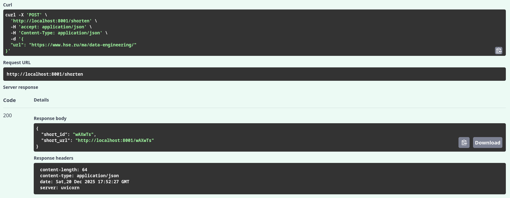

2. Редирект 
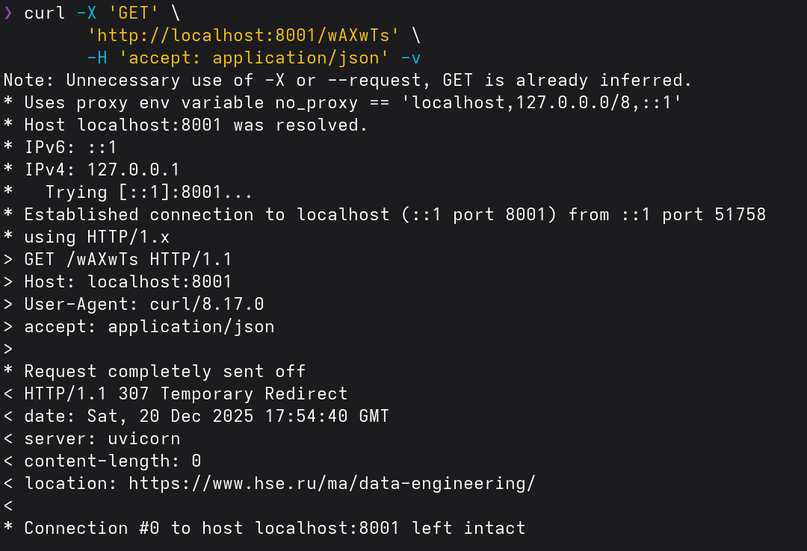
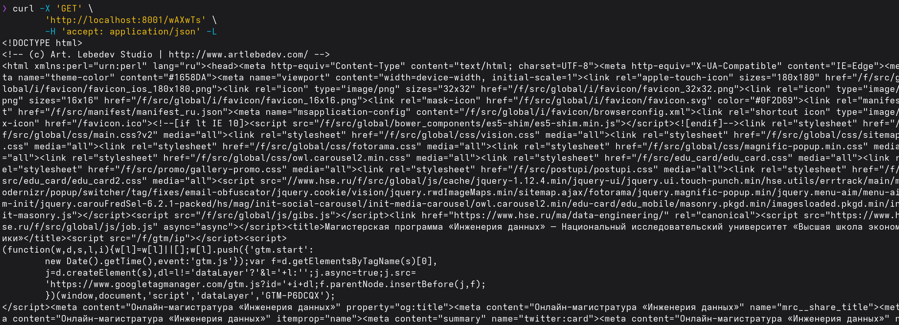

3. Статистика по ссылки
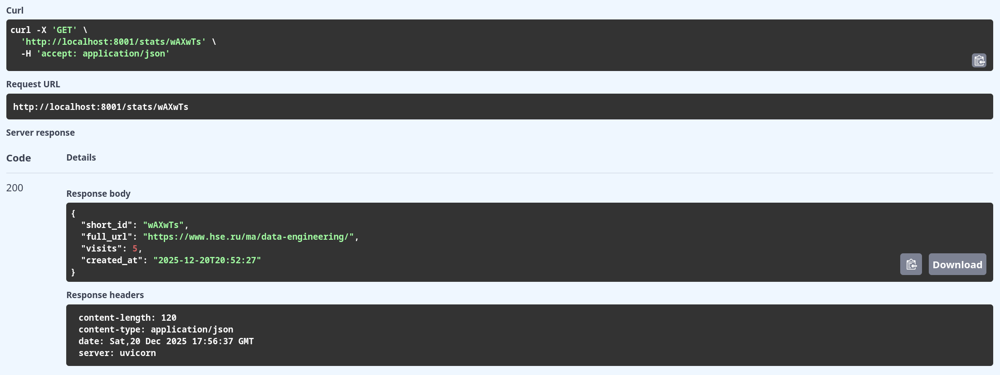

4. Получаем популярные ссылки
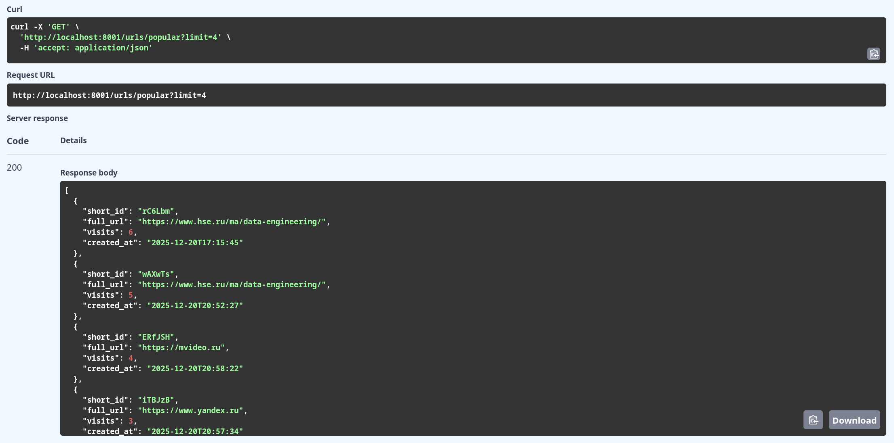