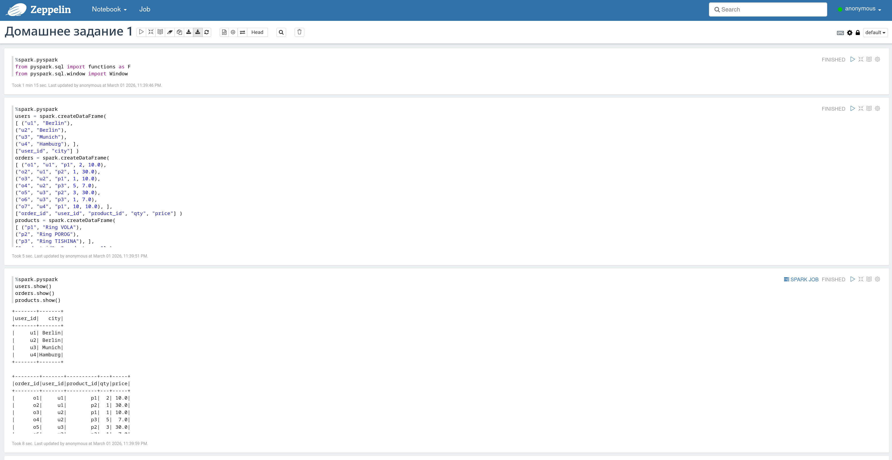
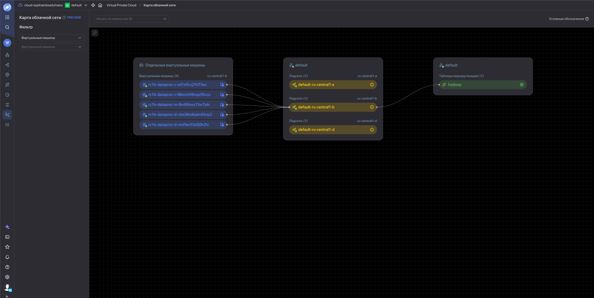

# Витрина Top-2 товаров по выручке в каждом городе

## Описание

В задании собрана витрина `mart_city_top_products` —
два самых прибыльных товара в каждом городе.

Расчёты выполнялись в Zeppelin.

## Структура проекта

В папке `notebooks `представлены версии как для Zeppelin, так и для Jupyter

```
Homework_1
├─ images
├─ notebooks
│  ├─ Домашнее задание 1.ipynb
│  └─ Домашнее задание 1_2MKDENHCQ.zpln
└─ README.md
```
## Результат
Скриншоты выполненной работы




