# Обработка анализ данных в Yandex Cloud: от загрузки до визуализации

## Описание

В данной работе выполнены задания 1, 2 и 3 из файла ДЗ1.

Задание 1 выполнено в Zeppelin и находится в папке notebooks. <br>
Задание 2 выполнено в виде SQL-скрипта и находится в папке scripts. <br>
Задание 3 представлено в виде скриншотов из DataLens.

## Структура проекта

В папке `notebooks `представлены версии как для Zeppelin, так и для Jupyter

```
Homework_1
├─ images
├─ notebooks
│  ├─ task1.ipynb
│  └─ task1_2MQBT9Y32.zpln
├─ scripts
│  └─ task2.sql
└─ README.md
```

## Результат

### Задание 1
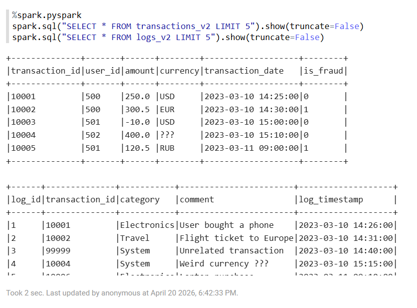

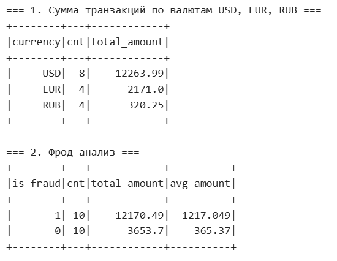

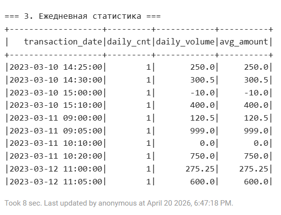

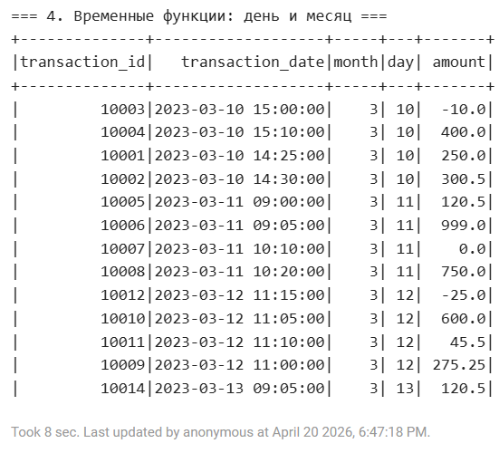

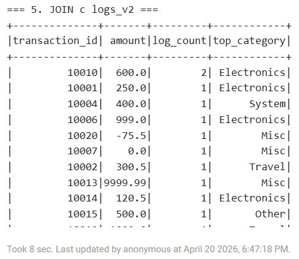

### Задание 2
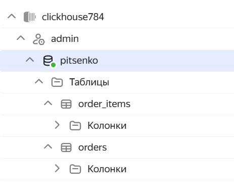

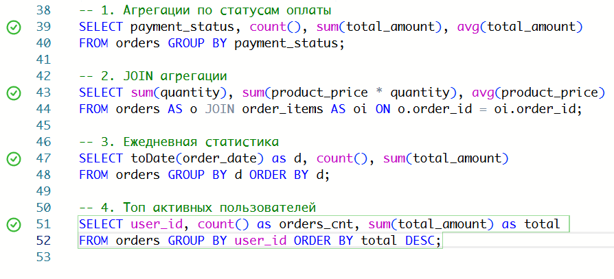

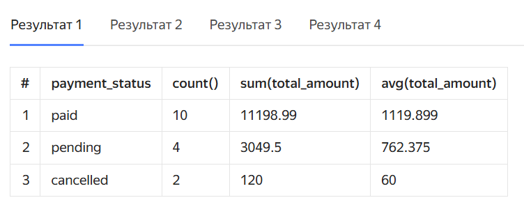

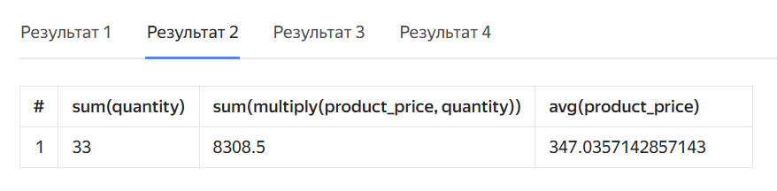

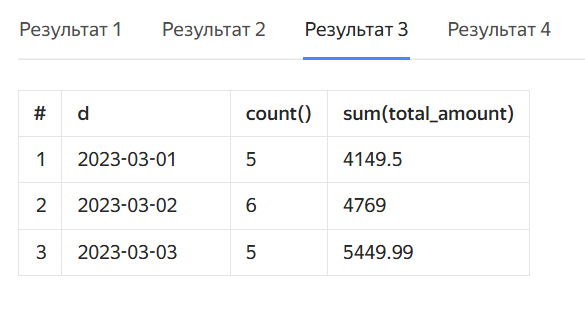

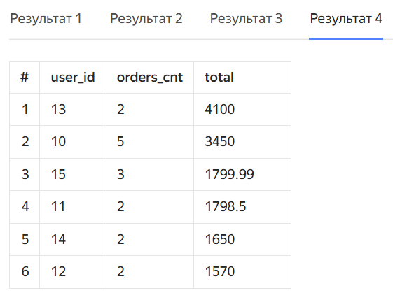

### Задание 3
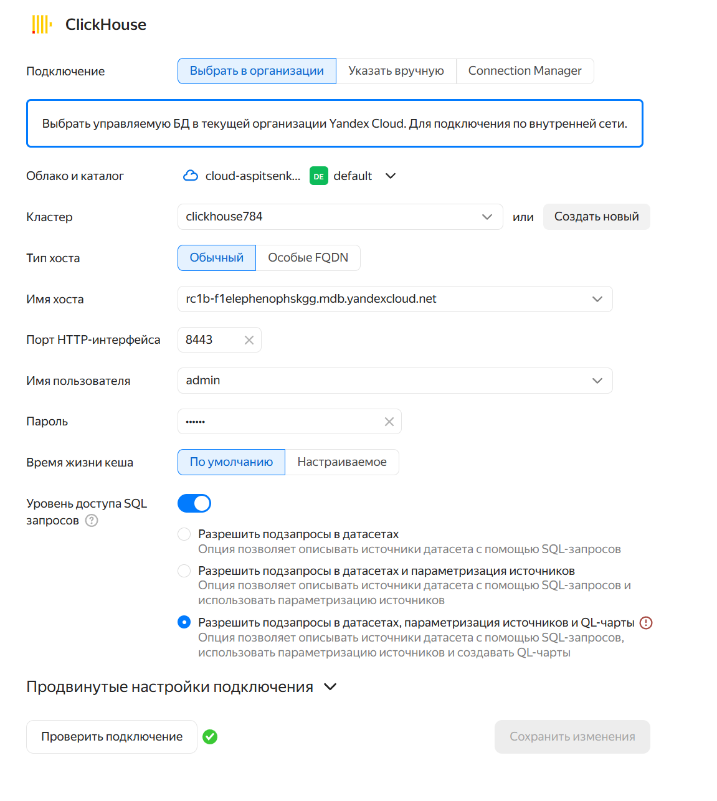

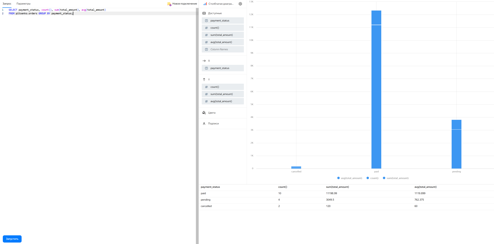

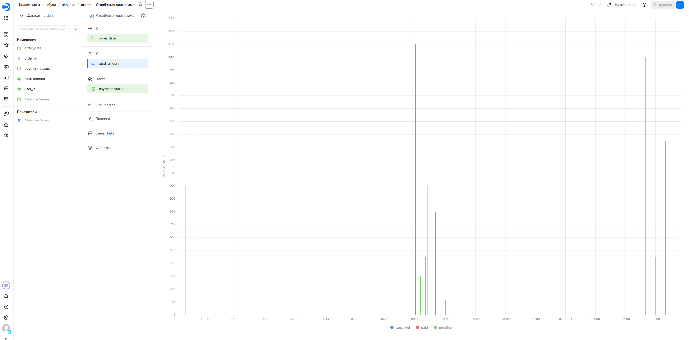

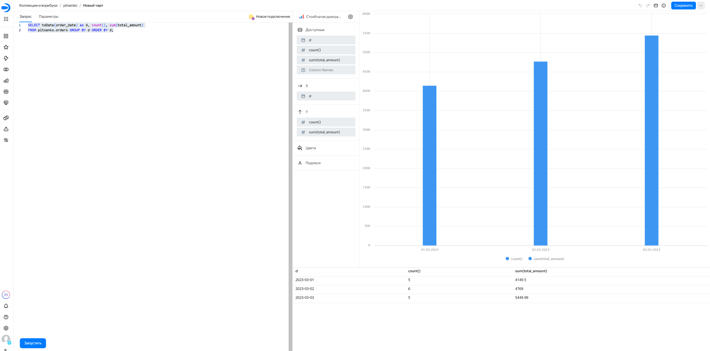

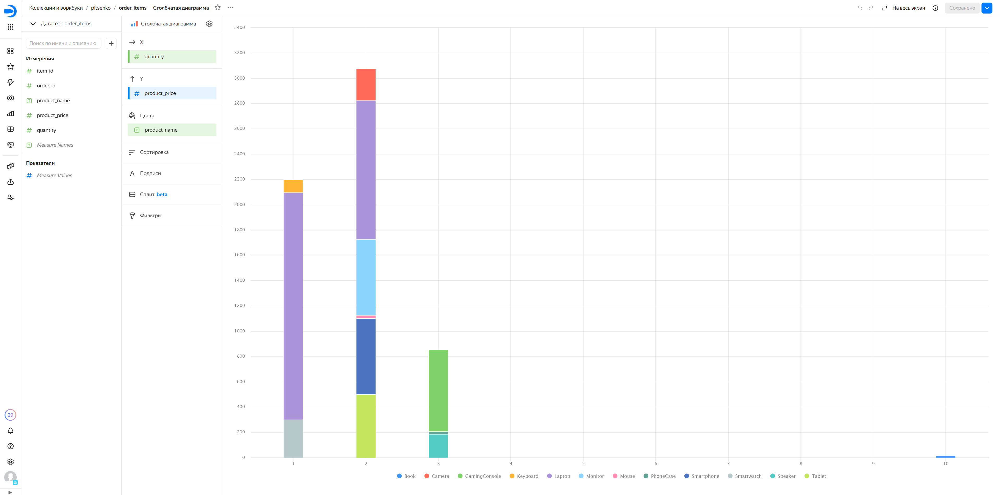

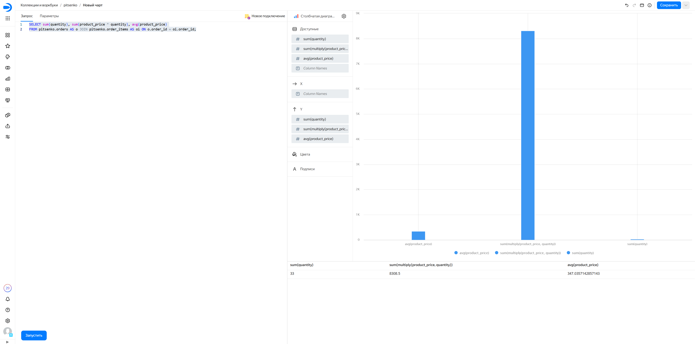